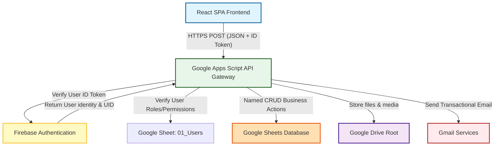

# NEXUS CRM & Operations Management System

NEXUS CRM is a centralized, secure task, event, team, budget, performance, and operations management platform designed specifically for the **NEXUS Forum (Academic Session 2026–27)**. 

The system acts as the single source of truth for all organization activities, coordinating members across different departments and replacing unstructured communication channels like WhatsApp and manual Google Sheets management.

---

## 🏗️ System Architecture

The application is built on a **secure server-less architecture** using a frontend-backend separation model. 

To ensure security, the React frontend **never** interacts directly with Google Sheets or Google Drive. All data mutations and read queries route through Google Apps Script, which acts as the API Gateway and enforces security, authentication, validation, and logging.



### Key Responsibilities

*   **React Frontend**: Responsible for rendering the UI, managing client-side navigation (React Router), form validation, and executing operations by calling backend endpoints using Axios or Fetch.
*   **Firebase Authentication**: Authenticates users securely via Email/Password. Resolves email to a unique Firebase UID (`firebaseUid`).
*   **Google Apps Script (Backend API)**: Serves as the API endpoint routing engine. Validates incoming requests using JWT tokens from Firebase, evaluates server-side permissions (checking the user's role in the `01_Users` table), performs operations, and formats responses.
*   **Google Sheets Database**: Serves as the structured relational database of the system.
*   **Google Drive**: Stores documents, posters, forms, newsletters, and budget receipts.

---

## 🛠️ Tech Stack

*   **Frontend**: React (v19) + Vite + TypeScript + TailwindCSS + Lucide Icons + React Router
*   **Backend**: Google Apps Script (ES6 runtime via V8 engine)
*   **Database**: Google Sheets (23 normalized tables)
*   **Authentication**: Firebase Authentication
*   **Notifications**: Google Apps Script SendMail integration (transmits HTML notifications to members on task assignment, verification results, etc.)

---

## 📂 Project Structure

```text
NEXUS_CRM/
├── apps-script/            # Google Apps Script Backend Code
│   ├── Config.gs           # Global constants, Spreadsheet and API Key configurations
│   ├── Router.gs           # API Router for POST requests, parses routing keys to handlers
│   ├── Auth.gs             # Authenticates Firebase ID tokens
│   ├── Permissions.gs      # Role-based server-side access control
│   ├── SheetRepository.gs  # Relational-like CRUD mapper over Google Sheets
│   ├── Setup.gs            # Idempotent database schema constructor & validator
│   ├── NotificationService.gs # Central notification dispatch engine (Gmail API)
│   ├── Response.gs         # Standard JSON response wrappers
│   ├── Validation.gs       # Server-side inputs validator
│   ├── appsscript.json     # Apps Script project settings and OAuth scopes
│   └── *Handler.gs         # Specific domain API endpoints (Tasks, Events, Budget...)
├── src/                    # React Frontend Code
│   ├── app/                # Main Application Layout and Routing Setup
│   ├── assets/             # Images and Static Assets
│   ├── components/         # Reusable Global UI Components (Buttons, Dialogs, Inputs)
│   ├── context/            # Global React Contexts (AuthContext, ThemeContext)
│   ├── features/           # Feature-based pages and modules
│   │   ├── auth/           # Login & Password resets
│   │   ├── dashboard/      # Real-time metrics, workload, status progress
│   │   ├── events/         # Events list, schedule planning, automatic task creator
│   │   ├── tasks/          # Board/Table, status updates, verifications
│   │   ├── teams/          # Department metrics, workload analyzer
│   │   ├── performance/    # President/VP evaluations & feedback scores
│   │   ├── recognition/    # Member spotlight and certificates download
│   │   ├── budget/         # Transaction logs, event budget approval queues
│   │   └── ...             # Other minor features (Birthdays, Social Media, Newsletter)
│   ├── hooks/              # Custom React Hooks
│   ├── services/           # Backend communication utilities (Axios API wrappers)
│   ├── types/              # TypeScript Types and Interfaces
│   ├── utils/              # Client-side helper functions
│   ├── index.css           # Global CSS styles (includes design tokens)
│   └── main.tsx            # Application entrypoint
├── index.html              # HTML shell
├── tailwind.config.js      # CSS Theme styling tokens
├── vite.config.ts          # Vite build config
├── tsconfig.json           # TS Configuration rules
└── .gitignore              # Ignored files (secrets, config, guides, developer scripts)
```

---

## 🗃️ Database Tab Schema (Google Sheets)

The database `NEXUS CRM — 2026–27` contains 23 tabs configured during initialization:

| Tab Name | Key Identifier | Description / Fields |
| :--- | :--- | :--- |
| `00_Settings` | `settingKey` | System-wide status lists, task priorities, configuration constants. |
| `01_Users` | `userId` | User database linking `firebaseUid` to name, email, role, team, and active status. |
| `02_Teams` | `teamId` | NEXUS departments (Technical, Socials, Logistics, etc.) and assigned leads. |
| `03_Events` | `eventId` | Event catalog with timelines, lead teams, Drive link, and milestone deadlines. |
| `04_Tasks` | `taskId` | Main task repository tracking assignee, verifier, deadlines, status, template info. |
| `05_Task_Updates` | `updateId` | Historical log tracking changes in task status, percent complete, and comments. |
| `06_Creative` | `creativeId` | Creative/Design workflow assets (designers, reviews, asset links, timelines). |
| `07_Social_Media` | `contentId` | Social media grid and posting schedule tracking platforms, deadlines, approvals. |
| `08_Newsletter` | `newsletterId` | Monthly newsletter planner. |
| `09_Birthdays` | `birthdayId` | Faculty/Member birthday greeting schedule and graphic status. |
| `10_Achievements` | `achievementId` | Official records of member achievements for social media posting. |
| `11_Forms` | `formId` | Event feedback/registration forms, links, and response trackers. |
| `12_Issues` | `issueId` | Incident reports, severity scale, raised issues, and resolutions. |
| `13_Meetings` | `meetingId` | Internal meeting minutes, decision logs, and action tasks. |
| `14_Budget` | `budgetId` | Financial ledger recording estimated budgets, actual expenses, sponsor status, invoice URLs. |
| `15_Recognition` | `recognitionId` | Monthly recognitions, volunteer hour logs, and certificate links. |
| `16_Documents` | `documentId` | Internal documents catalog linked to Google Drive folders. |
| `17_Reports` | `reportId` | Generated operation summaries and analytical performance logs. |
| `18_Performance` | `performanceId` | Executive evaluations (President/VP only) tracking scores across multiple metrics. |
| `19_Audit_Log` | `auditId` | Audit ledger logging user mutations, actions, entities, values, and timestamps. |
| `20_Event_Templates`| `templateId` | Predefined event-to-task blueprints for standard operational setups. |
| `21_Dashboard_Data`| `metricKey` | Aggregated analytics cached daily for performance optimization. |
| `22_Notifications` | `notificationId` | Dispatch ledger tracking outbound email statuses, errors, and delivery records. |

---

## 🚀 Setup & Installation

### 1. Backend Google Sheets & Apps Script Setup

1.  Create a new Google Sheet named **`NEXUS CRM — 2026–27`**.
2.  Open **Extensions** → **Apps Script**.
3.  Copy all files inside the local `apps-script/` directory into your Apps Script project (matching file names).
4.  Configure Script Settings:
    *   In the Apps Script Editor, click **Project Settings** (gear icon).
    *   Add a script property named `FIREBASE_API_KEY` and set it to your Firebase Web App API Key.
    *   Alternatively, modify the fallback variable `FIREBASE_API_KEY` inside your `Config.gs` file.
5.  In `Config.gs`, configure your `SPREADSHEET_ID` with the ID of the sheet created in Step 1:
    ```javascript
    var SPREADSHEET_ID = "YOUR_GOOGLE_SHEET_ID_HERE";
    ```
6.  Initialize the Database:
    *   Select the function `setupNexusSpreadsheet` in the editor dropdown.
    *   Click **Run**.
    *   Grant the requested Google permissions. This will automatically generate all 23 database tabs, build headers, apply formatting, add enums validation, and configure sheets protection.
7.  Deploy the API:
    *   Click **Deploy** → **New deployment**.
    *   Choose type: **Web app**.
    *   Set **Execute as**: `User accessing the web app` (or `Me` depending on your permission preference - `Me` is standard to permit write access to the Sheets/Drive database using your credentials).
    *   Set **Who has access**: `Anyone`.
    *   Click **Deploy** and copy the generated **Web App URL**.

---

### 2. Frontend React Setup

1.  Navigate to your local project directory.
2.  Create a local environment file named `.env` in the root folder based on `.env.example`:
    ```bash
    cp .env.example .env
    ```
3.  Fill in the Firebase App config values and paste the Web App URL from the Apps Script deployment step:
    ```ini
    # Firebase configuration
    VITE_FIREBASE_API_KEY=your_firebase_api_key
    VITE_FIREBASE_AUTH_DOMAIN=your_firebase_auth_domain
    VITE_FIREBASE_PROJECT_ID=your_firebase_project_id
    VITE_FIREBASE_STORAGE_BUCKET=your_firebase_storage_bucket
    VITE_FIREBASE_MESSAGING_SENDER_ID=your_firebase_sender_id
    VITE_FIREBASE_APP_ID=your_firebase_app_id

    # Apps Script backend API endpoint
    VITE_APPS_SCRIPT_URL=https://script.google.com/macros/s/.../exec
    ```
4.  Install dependencies and start the development server:
    ```bash
    npm install
    npm run dev
    ```
5.  Open your browser and navigate to the local URL (usually `http://localhost:5173`).

---

## 🔒 Security Guidelines

To maintain absolute data integrity and system security, adhere to these guidelines:
1.  **Do not commit `.env` files**: Local secrets are configured in `.gitignore` and must never be committed to Git.
2.  **No Client-Side Writes**: Never use Google Service Accounts or API credentials in the React bundle to edit sheets directly.
3.  **Role Verification**: All sensitive mutations (budget, tasks creation/edit, user additions, evaluations) are verified *server-side* in `Permissions.gs` before execution. Relying on frontend button-hiding for security is strictly prohibited.
4.  **Soft Deletions**: Never physically delete records from Google Sheets database rows. Toggle the `active` column to `FALSE` or set the state status to `CANCELLED`/`ARCHIVED`.
5.  **Audit Logs**: Every write/mutation operation must log the action, target entity, user, and previous/new values into the `19_Audit_Log` tab.
